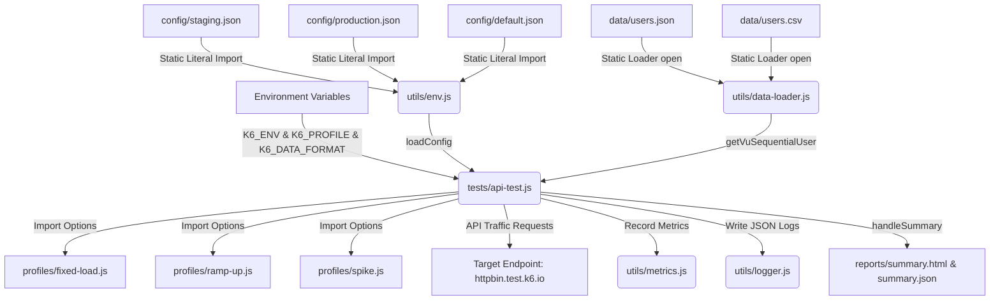

# K6 Performance Testing Boilerplate Framework

A complete, production-ready, modular performance testing framework built on **Grafana K6** adhering strictly to official performance engineering design patterns and best practices.

> [!TIP]
> **Live Performance Run History & Telemetry Dashboard**: Check out the continuous test results, IST execution histories, and expected-vs-actual validation gates at:
> **[https://mani-qa.github.io/K6-PerformanceTestingFramework/](https://mani-qa.github.io/K6-PerformanceTestingFramework/)**

---

## Functional Features
* **Multi-Scenario Architecture**: Built-in support for different testing profiles including **Fixed Load** (baseline), **Ramp-up** (stepped stress loading), and **Spike** (extreme surge and recovery tracking).
* **Decoupled Configuration System**: Independent environment targets (`staging` vs `production`) loaded dynamically through JSON files and overridden by system environment variables.
* **K6 Safe Loader Implementation**: Resolves K6 compilation limitations by loading all environment configs statically via literal `open()` imports and dynamically routing them at runtime execution.
* **Structured JSON Logging**: Custom logging helper formatting stdout as structured JSON to ensure high-load tracking details are readily ingestible by Datadog, Grafana Loki, or Elasticsearch.
* **Custom Performance Metrics**: Tracks transaction throughput and latency metrics using custom Grafana metrics:
  * `custom_http_req_duration_ms` (Trend)
  * `custom_success_rate` (Rate)
  * `custom_transaction_count` (Counter)
  * `custom_active_vus` (Gauge)
* **Multi-Format Data Parameterization**: Parameterize test scenarios by loading test credentials dynamically from either a JSON array or a CSV file (parsed using the K6-optimized PapaParse library), toggled simply via environment variables.
* **Build Failure Gates**: Fine-grained error rate and latency percentile validation gates (checks and thresholds) that raise failure exit codes to cleanly halt CI/CD merges.
* **Automated Summary Reporting**: Exports standard JSON summaries alongside beautifully rendered visual HTML report dashboards natively via the K6 `handleSummary` hook.

---

## ⚙️ Configuration Guide

This framework is built to be extremely flexible. You can customize test scenarios, input datasets, and load intensities **without rewriting any core test logic**.

### 1. Adjusting Scenario Profiles (Fixed, Stress, or Spike)
The load shape is defined inside the files under the `profiles/` directory.

* **Fixed Baseline Profile (`profiles/fixed-load.js`)**:
  * Edit the `vus` (Virtual Users) and `duration` values directly:
    ```javascript
    vus: 10,       // Number of concurrent simulated users
    duration: '30s' // Test duration (e.g. '30s', '5m', '1h')
    ```
* **Stress (Ramp-up) Profile (`profiles/ramp-up.js`)**:
  * Steps up the load gradually. Adjust the `stages` targets and times:
    ```javascript
    stages: [
      { duration: '10s', target: 20 }, // Ramp from 0 to 20 VUs in 10s
      { duration: '15s', target: 50 }, // Ramp from 20 to 50 VUs in 15s
      { duration: '20s', target: 50 }, // Maintain 50 VUs for 20s
      { duration: '10s', target: 0 },  // Cool down back to 0 in 10s
    ]
    ```
* **Spike Profile (`profiles/spike.js`)**:
  * Simulates a sudden traffic surge. Edit stage target peaks to check auto-scaling latency.

### 2. Modifying Your Test Datasets
You can customize the credentials, API paths, or dynamic fields fed to your tests in two simple formats:
* **JSON Format (`data/users.json`)**:
  Add, remove, or modify user records. Ensure they follow the structured layout:
  ```json
  [
    { "id": 1, "username": "your_custom_user", "role": "admin" }
  ]
  ```
* **CSV Format (`data/users.csv`)**:
  Add rows below the header column names (`id,username,role`):
  ```csv
  id,username,role
  1,your_custom_user,admin
  ```
* *Note: The data-loader automatically loops through this array sequentially, ensuring VUs receive separate credentials and do not step on each other.*

### 3. Adding New Tests (New Target URLs & Payloads)

To add tests targeting a new API endpoint or include custom JSON/form payloads, follow this simple workflow:

#### Step A: Update Environment Targets or Host Configurations (Optional)
If your new endpoints reside on a different host or use specific headers, declare them in the environment config files under `config/`:
* [`config/default.json`](file:///c:/Users/Maniv/Code/K6-PerformanceTestingFramework/config/default.json)
* [`config/staging.json`](file:///c:/Users/Maniv/Code/K6-PerformanceTestingFramework/config/staging.json)
* [`config/production.json`](file:///c:/Users/Maniv/Code/K6-PerformanceTestingFramework/config/production.json)

#### Step B: Define Parameterized User Data
Add any parameterized variables required for your new requests (e.g., custom item IDs, account tokens, product categories) to your test dataset:
* **JSON format**: Append key-value pairs in [`data/users.json`](file:///c:/Users/Maniv/Code/K6-PerformanceTestingFramework/data/users.json):
  ```json
  [
    { "id": 1, "username": "user1", "role": "admin", "customField": "order_val_1" }
  ]
  ```
* **CSV format**: Add a new column to the header and rows in [`data/users.csv`](file:///c:/Users/Maniv/Code/K6-PerformanceTestingFramework/data/users.csv):
  ```csv
  id,username,role,customField
  1,user1,admin,order_val_1
  ```

#### Step C: Create a Dedicated Test Script
Instead of modifying the boilerplate example [`tests/api-test.js`](file:///c:/Users/Maniv/Code/K6-PerformanceTestingFramework/tests/api-test.js) directly, it is best practice to create a dedicated test file inside the `tests/` directory (e.g., `tests/order-service-test.js`). 

You can copy the example file as a starting template and customize the transaction logic. Below is a code structure for implementing your new POST request with custom JSON payload and verification checks:

```javascript
// tests/order-service-test.js
import http from 'k6/http';
import { check, sleep } from 'k6';

// Import modular environment loader and data utils
import { loadConfig } from '../utils/env.js';
import { loadTestData, getVuSequentialUser } from '../utils/data-loader.js';
import { logger } from '../utils/logger.js';
import { customHttpReqDuration, customSuccessRate, customTransactionCount } from '../utils/metrics.js';

// Load load scenario profiles
import { fixedLoadScenarios, fixedLoadThresholds } from '../profiles/fixed-load.js';
import { rampUpScenarios, rampUpThresholds } from '../profiles/ramp-up.js';
import { spikeScenarios, spikeThresholds } from '../profiles/spike.js';

const config = loadConfig();
const testData = loadTestData();

const profiles = {
  fixed: { scenarios: fixedLoadScenarios, thresholds: fixedLoadThresholds },
  'ramp-up': { scenarios: rampUpScenarios, thresholds: rampUpThresholds },
  spike: { scenarios: spikeScenarios, thresholds: spikeThresholds }
};

const selectedProfileName = __ENV.K6_PROFILE || 'fixed';
const activeProfile = profiles[selectedProfileName] || profiles.fixed;

export const options = {
  scenarios: activeProfile.scenarios,
  thresholds: activeProfile.thresholds
};

export default function () {
  const vuId = __VU;
  const iterationId = __ITER;
  const user = getVuSequentialUser(testData, vuId);
  
  // ----------------------------------------------------
  // TRANSACTION: CREATE ORDER (CUSTOM PAYLOAD TEST)
  // ----------------------------------------------------
  const orderUrl = `${config.baseUrl}/post`; // Adjust endpoint path
  const orderPayload = JSON.stringify({
    userId: user.id,
    orderId: `order-${vuId}-${iterationId}`,
    productType: user.role === 'admin' ? 'premium-bundle' : 'standard-item',
    customData: user.customField || 'default_val',
    timestamp: new Date().toISOString()
  });

  const orderParams = {
    timeout: parseInt(config.timeout, 10),
    headers: {
      'Content-Type': 'application/json',
      'User-Agent': 'K6-Performance-Framework',
      'X-Transaction-ID': `tx-${vuId}-${iterationId}`
    }
  };

  logger.debug('Starting Create Order transaction', { vu: vuId, iteration: iterationId });

  const startTime = Date.now();
  let orderResponse = http.post(orderUrl, orderPayload, orderParams);
  const duration = Date.now() - startTime;

  // 1. Record custom latency trend
  customHttpReqDuration.add(duration);

  // 2. Perform validations (Checks)
  let orderCheck = check(orderResponse, {
    'Order status is 200': (r) => r.status === 200,
    'Order creation echoed payload': (r) => {
      try {
        const json = JSON.parse(r.body);
        const echoed = json.json || JSON.parse(json.data);
        return echoed.userId === user.id && echoed.orderId !== undefined;
      } catch (e) {
        return false;
      }
    }
  });

  // 3. Track custom metrics & logs
  customSuccessRate.add(orderCheck);
  if (orderCheck) {
    customTransactionCount.add(1);
  } else {
    logger.error('Order transaction validation failed', {
      vu: vuId,
      status: orderResponse.status,
      body: orderResponse.body ? orderResponse.body.substring(0, 200) : ''
    });
  }

  sleep(1);
}

export { handleSummary } from './api-test.js'; // Re-use common HTML/JSON summary generation
```

#### Step D: Update `package.json` to Run Your New Test
Open [`package.json`](file:///c:/Users/Maniv/Code/K6-PerformanceTestingFramework/package.json) and configure a new script runner in the `"scripts"` object to execute your new test file under specific environments and profiles:

```json
"scripts": {
  "test:fixed:staging": "cross-env K6_ENV=staging K6_PROFILE=fixed k6 run tests/api-test.js",
  "test:order:fixed": "cross-env K6_ENV=staging K6_PROFILE=fixed k6 run tests/order-service-test.js",
  "test:order:rampup": "cross-env K6_ENV=staging K6_PROFILE=ramp-up k6 run tests/order-service-test.js"
}
```

Now you can run your customized performance test suite easily using standard npm commands:
```bash
npm run test:order:fixed
```

---

## ⚡ Command-Line Execution & Overrides

You can override virtual users, durations, and stages directly from your command line **without changing any code in your files**.

### Option A: Native K6 Command-Line Overrides (Ad-Hoc Running)
Passing native K6 flags automatically bypasses all profiles, scenario structures, and thresholds in favor of a quick, custom ad-hoc execution:

* **Override VUs and Duration on-the-fly**:
  ```bash
  # Run a simple test using 25 Virtual Users for 45 seconds
  k6 run --vus 25 --duration 45s tests/api-test.js
  ```
* **Override Ramping Stages on-the-fly**:
  ```bash
  # Ramp up to 10 VUs in 5s, scale to 30 VUs in 10s, cool down in 5s
  k6 run --stage 5s:10,10s:30,5s:0 tests/api-test.js
  ```

### Option B: Structured Scenario Scaling (Profile-Preserved Overrides)
If you want to keep the custom assertions/thresholds and multi-stage shape of your structured profiles but scale their intensity, pass environment variables:

* **Fixed Baseline Profile: Custom VUs & Duration**:
  ```bash
  # Scale Fixed Baseline scenario to 50 concurrent VUs for 2 minutes
  npx cross-env K6_VUS=50 K6_DURATION=2m npm run test:fixed:staging
  ```
* **Stress (Ramp-up) Profile: Scale the Peak Load**:
  ```bash
  # Scale peak load of your stress ramping stages to 150 VUs (ratios auto-adjust)
  npx cross-env K6_MAX_VUS=150 npm run test:rampup:staging
  ```
* **Spike Profile: Scale the Peak Surge**:
  ```bash
  # Scale maximum traffic burst peak of your spike stages to 300 VUs
  npx cross-env K6_SPIKE_VUS=300 npm run test:spike:staging
  ```

---

## User Guide

### 1. Local Prerequisites
You must have the following tools installed on your local workstation:
* **K6 CLI Engine**: Install via homebrew (`brew install k6`), scoop (`scoop install k6`), winget (`winget install gnu.k6`), or direct binary downloads.
* **Node.js LTS (v20+)**: Required for running the task automation script runners.

### 2. Framework Installation
Clone the repository and install developer support packages:
```bash
# Install cross-env and support tools
npm install
```

### 3. Executing Tests Locally
The framework includes convenient scripts to easily select execution targets:

#### Run Fixed Baseline Load:
* Run against **Staging**:
  ```bash
  npm run test:fixed:staging
  ```
* Run against **Production**:
  ```bash
  npm run test:fixed:prod
  ```

#### Run Stress (Ramp-up) Test:
* Run against **Staging**:
  ```bash
  npm run test:rampup:staging
  ```
* Run against **Production**:
  ```bash
  npm run test:rampup:prod
  ```

#### Run Traffic Spike Test:
* Run against **Staging**:
  ```bash
  npm run test:spike:staging
  ```
* Run against **Production**:
  ```bash
  npm run test:spike:prod
  ```

#### Select Data Input Format (CSV or JSON)
By default, the framework runs with **JSON** format. You can switch to **CSV** data parsing by passing the `K6_DATA_FORMAT=csv` environment variable prefix:
* Run with **CSV** data format:
  ```bash
  npx cross-env K6_DATA_FORMAT=csv k6 run tests/api-test.js
  ```
* Or combine it with our script runners:
  ```bash
  npx cross-env K6_DATA_FORMAT=csv npm run test:fixed:staging
  ```

---

## Architecture Information

### Technical Breakdown & Data Flow
The framework is designed to bypass K6 execution engine boundaries while preserving standard software design principles.



1. **Compilation Phase**:
   * K6 scans the scripts and compiles the files.
   * `utils/env.js` imports all environment profiles using the mandatory literal string path `open()` syntax.
   * `utils/data-loader.js` loads `users.json` and `users.csv` statically.
2. **Setup/Init Phase**:
   * `tests/api-test.js` resolves the environment variables `__ENV.K6_ENV` and `__ENV.K6_PROFILE`.
   * The active load profile is resolved, and its scenarios and thresholds options are exported.
3. **Execution Phase**:
   * Virtual Users (VUs) execute the test loops.
   * Dynamic data loader allocates unique, sequential users to each VU iteration using `getVuSequentialUser(data, __VU)`.
   * Standard and custom metrics (`Trend`, `Rate`, `Counter`, `Gauge`) are captured on each HTTP response check.
   * On validation failure, a structured JSON entry is written to stdout.
4. **Summary & Reporting Phase**:
   * On completion, K6 invokes `handleSummary()`.
   * HTML summary pages and JSON telemetry snapshots are written directly to the `reports/` folder.

---

## Tech Stack
* **Core Engine**: Grafana K6 (Goja JS runtime engine)
* **Standard Specifications**: ES6 Modules (import/export syntax)
* **Reporting Extensions**: `k6-reporter` (HTML) and `k6-summary` (JSON)
* **Log Formatting**: JSON Structured Logging
* **Automation**: GitHub Actions & npm scripts

---

## Pending Features and Roadmap
* [x] **Data Parameterization Expansion**: Integrate CSV file streams for structured datasets using PapaParse.
* [ ] **Distributed Execution Setup**: Configure Kubernetes K6 Operator templates for orchestrating cloud-scale distributed tests.
* [ ] **API Gateway Integrations**: Add automated OpenID Connect/OAuth2 authentication token renewal routines inside the K6 `setup()` hook.
* [ ] **Telemetry Ingestion Hook**: Export live testing statistics straight to Prometheus/InfluxDB for real-time visualization in Grafana dashboards.
